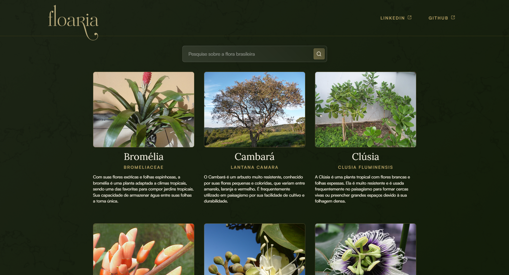

# Floaria

Desenvolvido com o intuito de aprender sobre os fundamentos básicos do JavaScript durante o evento Imersão Dev com Google Gemini da Alura. O código implementa uma funcionalidade de busca, filtrando e exibindo resultados. O código segue as boas práticas de clean code.

## Tecnologias

- **HTML5**
- **CSS3**
- **JavaScript**

## Instalação

1. Clone este repositório em sua máquina local:
    ```bash
    git clone https://github.com/seu-usuario/floaria.git
    ```
2. Navegue até o diretório do projeto:
    ```bash
    cd floaria
    ```
3. Abra o arquivo `index.html` em seu navegador para visualizar o projeto.

## Atualizações

- ✅ Realizar a busca pressionando Enter.
- ✅ Resultados aparecem em ordem alfabética.
- ✅ Transformar os resultados em cards clicáveis.
- ✅ Adicionar responsividade.
- ✅ Adicionar sugestões de pesquisa.
- Criar novas telas.

## Contribuição

Se você deseja contribuir para este projeto, siga os passos abaixo:

1. **Faça um fork do repositório**.

2. **Crie uma nova branch** para sua contribuição:
   ```bash
   git checkout -b minha-contribuicao
   ```
3. **Faça suas alterações e commit**:
   ```bash
   git commit -m 'Adicionar nova funcionalidade'
   ```
4. **Envie as alterações para o repositório remoto**:
   ```bash
   git push origin minha-contribuicao
   ```
5. **Abra um pull request** no repositório original.
